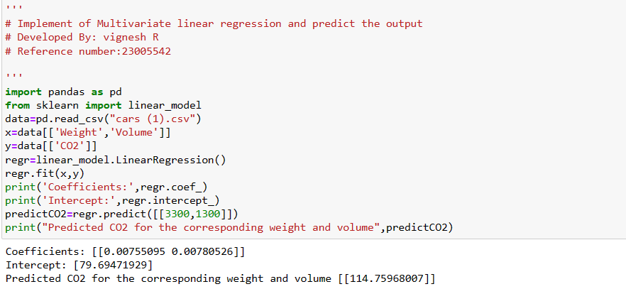

# Implementation of Multivariate Linear Regression
## Aim
To write a python program to implement multivariate linear regression and predict the output.
## Equipment’s required:
1.	Hardware – PCs
2.	Anaconda – Python 3.7 Installation / Moodle-Code Runner
## Algorithm:

### Step1
Import pandas

### Step2
Import linear model from sklearn

### Step3
Read the files cars.csv

### Step4
Assign the values for x and y as requried

### Step5
Create the LinearRegression model and predic the output
## Program:
```python
# Implement of Multivariate linear regression and predict the output
# Developed By: vignesh R
# Reference number:23005542
import pandas as pd
from sklearn import linear_model
data=pd.read_csv("cars (1).csv")
x=data[['Weight','Volume']]
y=data[['CO2']]
regr=linear_model.LinearRegression()
regr.fit(x,y)
print('Coefficients:',regr.coef_)
print('Intercept:',regr.intercept_)
predictCO2=regr.predict([[3300,1300]])
print("Predicted CO2 for the corresponding weight and volume",predictCO2)


```
## Output:

## Result
Thus the multivariate linear regression is implemented and predicted the output using python program.